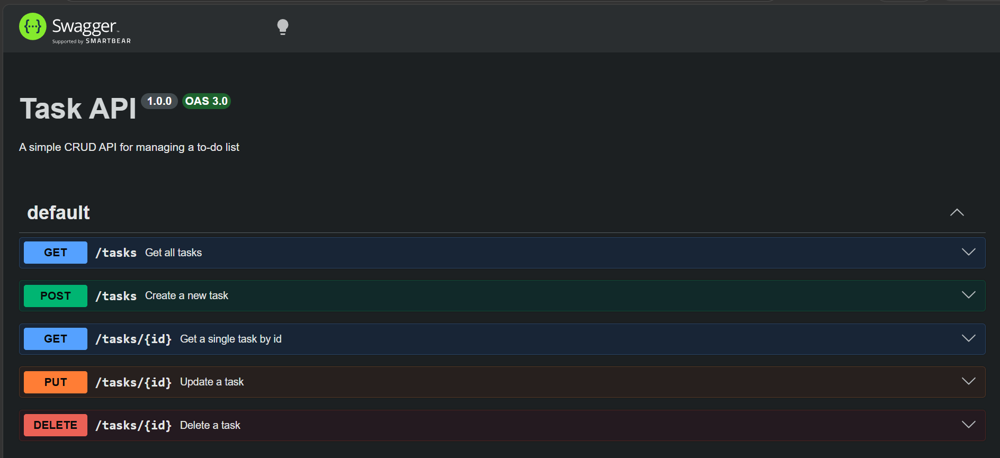

# Task API

A simple CRUD API for managing a to-do list, built with Node.js and Express.

## How to run

1. Clone this repo
2. Install dependencies: `npm install`
3. Start the server: `node server.js`
4. Server runs at `http://localhost:3000`

## Endpoints

| Method | Path | Description |
|--------|------|--------------|
| GET | / | API info |
| GET | /health | Health check |
| GET | /tasks | Get all tasks |
| GET | /tasks/:id | Get one task |
| POST | /tasks | Create a task |
| PUT | /tasks/:id | Update a task |
| DELETE | /tasks/:id | Delete a task |

## Optional extras

| Method | Path | Description |
|--------|------|--------------|
| GET | /tasks?done=true | Filter tasks by done status |
| GET | /tasks?search=milk | Search tasks by title |
| GET | /stats | Get task counts (total, done, open) |
| POST | /reset | Reset tasks to the original 3 |

## Example request

curl -i http://localhost:3000/tasks/1

HTTP/1.1 200 OK
X-Powered-By: Express
Content-Type: application/json; charset=utf-8
Content-Length: 40

{"id":1,"title":"Buy milk","done":false}

## Swagger UI

Interactive docs available at `http://localhost:3000/docs`

## Mortality experiment

When the server restarts, all tasks return to the original 3 seed tasks — anything created, updated, or deleted is lost. This happens because the task list lives only in the program's memory (a JavaScript array), which resets every time Node.js starts fresh; nothing was ever saved to disk.